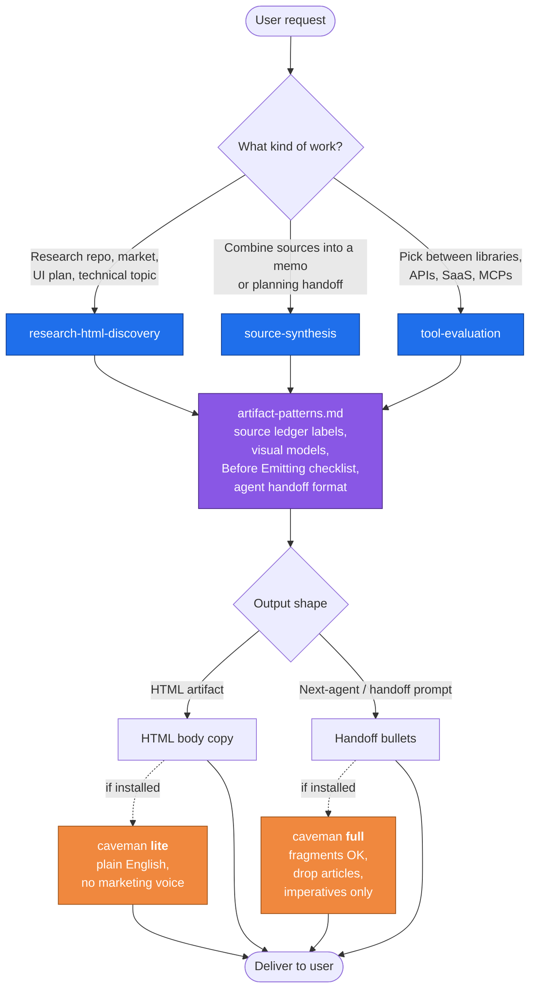

# Research Artifacts

Personal research and discovery skills for agent workflows.

This repo is skills-first. The main install path is the Vercel `skills` CLI because it can install the same `skills/` directory into Codex, Claude Code, Cursor, Gemini CLI, OpenCode, and other agents.

## Install

From `/Users/thisguymartin/personal-workspace`:

```bash
npx skills add ./research-artifacts --list
npx skills add ./research-artifacts --all -g
```

Install into only the current project instead of globally:

```bash
npx skills add ./research-artifacts --all
```

Install globally for Codex only:

```bash
npx skills add ./research-artifacts -a codex -g
```

After publishing the repo publicly:

```bash
npx skills add mpatino117/research-artifacts --all -g
```

To avoid CLI telemetry while installing:

```bash
DISABLE_TELEMETRY=1 npx skills add ./research-artifacts --all -g
```

## Skills

- `research-html-discovery` - research reports and HTML discovery artifacts.
- `tool-evaluation` - maintenance, license, adoption, cost, and stack-fit reviews.
- `source-synthesis` - compact sourced summaries that separate facts from inference.

## Flow

How a user request routes through the skills and where the optional [caveman](https://github.com/JuliusBrussee/caveman) skill kicks in:



Read it as: pick one of the three skills based on the task → all three share `artifact-patterns.md` for structure → output is either an HTML artifact (human-readable) or a handoff prompt (agent-readable) → if caveman is installed globally, those outputs route through `lite` or `full` mode for token savings and plain-English copy.

## Recommended Companion Skill — caveman

The three skills above reference the official [caveman](https://github.com/JuliusBrussee/caveman) skill for two things:

- **Inter-agent handoffs** (`full` mode) — terse, fragment-OK prompts for the next agent. Cuts ~75% of inter-agent tokens.
- **HTML artifact body copy** (`lite` mode) — plain English, no marketing voice, full sentences kept so humans read it cleanly.

Install once globally so the references resolve:

```bash
npx skills add JuliusBrussee/caveman -g
```

The full upstream suite also ships `caveman-commit`, `caveman-review`, `caveman-compress`, `caveman-stats`, `cavecrew`, and a `SessionStart` hook for always-on activation in Claude Code. See upstream for install paths per agent.

## Optional Plugin Installs

The repo also includes plugin metadata for Codex and Claude Code.

Codex local marketplace:

```bash
codex plugin marketplace add /Users/thisguymartin/personal-workspace/research-artifacts
```

Then open `/plugins`, choose `Research Artifacts`, and install it.

Claude Code local marketplace:

```text
/plugin marketplace add /Users/thisguymartin/personal-workspace/research-artifacts
/plugin install research-artifacts@research-artifacts
```

## References

- Vercel skills CLI: https://github.com/vercel-labs/skills
- Agent Skills spec: https://agentskills.io/specification
- Codex plugins: https://developers.openai.com/codex/plugins
- Claude Code plugins: https://code.claude.com/docs/en/plugins
