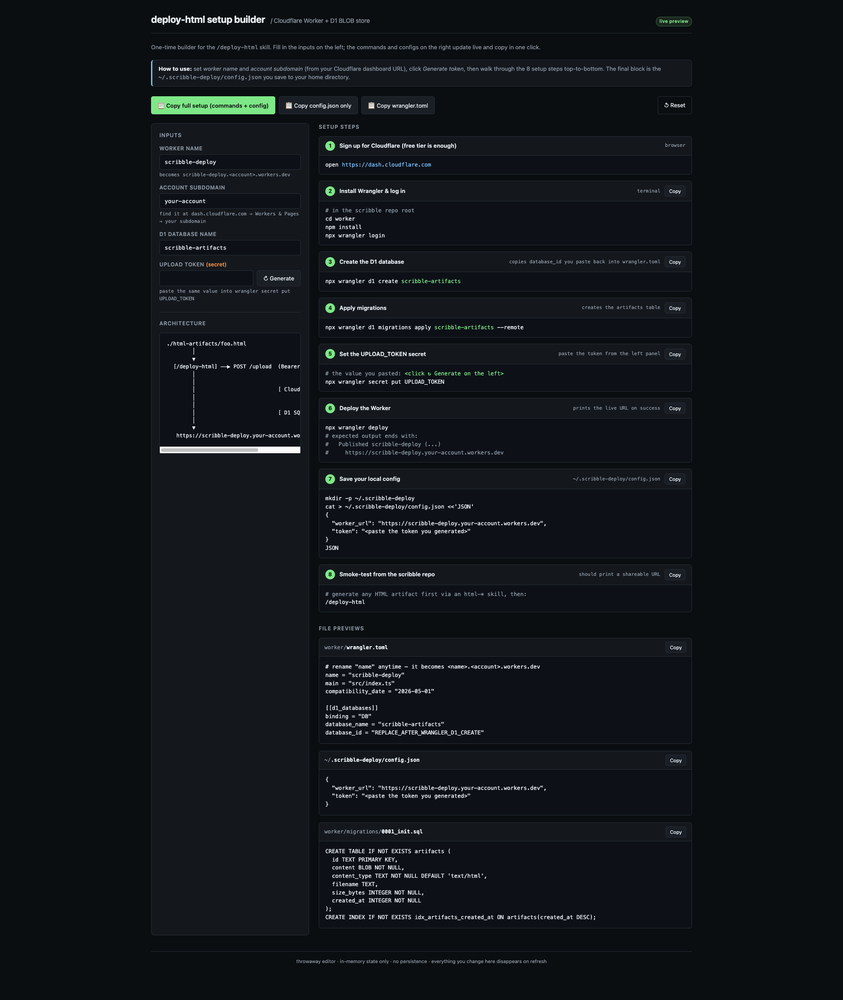

# Proposal: `/deploy-html` — Cloudflare Worker + D1 SQLite blob store for HTML artifacts

> Status: proposal · tracked in companion issue · v1 scope below

## Context

The scribble HTML skills (`html-effectiveness`, `html-tool`, `html-research`, `html-walkthrough`, `html-compare`) all output self-contained, single-file artifacts at `./html-artifacts/<topic>-<YYYY-MM-DD>.html`. Today there is no path from "I generated an artifact" to "I sent someone a URL."

This proposal adds a small, **fully self-contained** service so any scribble user — starting from zero with only a Cloudflare account — can publish those artifacts to short URLs they own. Nothing here depends on private or third-party infrastructure. The service runs on Cloudflare's free tier and stores each HTML file as a BLOB in a Cloudflare D1 (SQLite) database, so reusing the same DB across many artifacts is the default.

**Goal:** ship a tiny Cloudflare Worker + D1 service + a `/deploy-html` skill that uploads the newest artifact with one command and prints a shareable URL.

**Out of scope (v1):** custom domains, web dashboard UI, expiry/TTL, multi-user access control, file types other than HTML, public/private split.

## Decisions

- **Backend:** brand-new Cloudflare Worker + D1, owned by the deploying user. SQLite BLOB storage, deliberately reusable across uploads.
- **Auth:** single static `Bearer` token. Stored as a Worker secret server-side; stored once in a local config file client-side.
- **Skill shape:** new `/deploy-html` skill, called explicitly. Existing html-* skills unchanged.
- **Agnostic:** no org-specific names, hosts, identity providers, or assumptions about the user's existing infra.

## Architecture

```
HTML skill writes ./html-artifacts/foo-YYYY-MM-DD.html
        |
        v
/deploy-html skill (scripts/deploy.sh)
   reads ~/.scribble-deploy/config.json {worker_url, token}
   curl -X POST $worker_url/upload
        -H "Authorization: Bearer $token"
        -F "file=@foo-YYYY-MM-DD.html"
        |
        v
Cloudflare Worker (src/index.ts)
   - validates Bearer token (constant-time compare)
   - generates 10-char nanoid
   - INSERT INTO artifacts (id, content, content_type, filename, size_bytes, created_at)
   - returns {url, id}
        |
        v
Cloudflare D1 (SQLite)
   artifacts(id TEXT PK, content BLOB, content_type TEXT,
             filename TEXT, size_bytes INTEGER, created_at INTEGER)

GET https://<worker-name>.<account>.workers.dev/a/abc123xyz0
   - SELECT content, content_type FROM artifacts WHERE id = ?
   - return BLOB with Content-Type header, Cache-Control: public, max-age=31536000, immutable
```

## Components

### 1. Cloudflare Worker — new `worker/` directory at repo root

| File | Purpose |
|---|---|
| `worker/wrangler.toml` | name, main, compatibility_date, D1 binding |
| `worker/migrations/0001_init.sql` | creates `artifacts` table |
| `worker/src/index.ts` | single-file Worker with 5 routes |
| `worker/package.json` | wrangler, @cloudflare/workers-types, typescript |
| `worker/tsconfig.json` | minimal Workers TS config |
| `worker/README.md` | zero-to-deployed onboarding (8 steps) |

Routes:

| Method | Path     | Auth   | Action |
|--------|----------|--------|--------|
| POST   | `/upload`| Bearer | multipart form `file=@...` → INSERT, return `{url, id}` |
| GET    | `/a/:id` | none   | SELECT content WHERE id, return BLOB |
| GET    | `/list`  | Bearer | recent uploads, JSON |
| DELETE | `/a/:id` | Bearer | DELETE FROM artifacts WHERE id |
| GET    | `/`      | none   | minimal index page: count + usage example |

Implementation notes:
- ID generation: nanoid-style 10-char `[a-z0-9]` (~50 bits). Retry on rare PK collision.
- Token compare: constant-time against `env.UPLOAD_TOKEN`.
- Body cap: 900 KB enforced pre-INSERT (D1 single-row cap ~1 MB). Return 413 above.
- Response headers on GET `/a/:id`: `Content-Type: text/html; charset=utf-8`, `Cache-Control: public, max-age=31536000, immutable`, `X-Content-Type-Options: nosniff`.

### 2. Skill — new `skills/deploy-html/` directory

| File | Purpose |
|---|---|
| `skills/deploy-html/SKILL.md` | frontmatter + triggers + behavior |
| `skills/deploy-html/scripts/deploy.sh` | upload newest artifact, print URL |
| `skills/deploy-html/scripts/list.sh` | print recent uploads |
| `skills/deploy-html/scripts/delete.sh` | delete by id |

Skill behavior:
- **Trigger:** "deploy this html", "share this artifact", "publish artifact", "/deploy-html"
- **Prereq:** `~/.scribble-deploy/config.json` exists with `{worker_url, token}`. If missing, print exact `mkdir + cat > ... <<JSON` block.
- **Default:** newest `*.html` in `./html-artifacts/` by mtime.
- **With arg:** explicit path: `/deploy-html path/to/file.html`.
- **Output:** prints only the shareable URL on success.

### 3. Local config — per-user, not in repo

`~/.scribble-deploy/config.json`, created once after Worker deploy:

```json
{
  "worker_url": "https://<your-worker>.<account>.workers.dev",
  "token": "<the same hex you fed to `wrangler secret put UPLOAD_TOKEN`>"
}
```

### 4. Repo additions

- `.gitignore`: `worker/node_modules`, `worker/.dev.vars`, `worker/.wrangler`, `worker/dist`
- `README.md`: short "Sharing artifacts" section — **bring-your-own Cloudflare account**, nothing pre-hosted.

## Setup builder artifact

This proposal ships with an interactive single-file HTML artifact that generates a personalized setup script: [`html-artifacts/deploy-html-tool-2026-05-15.html`](../../html-artifacts/deploy-html-tool-2026-05-15.html).

It accepts your worker name, account subdomain, and D1 name; generates a 256-bit hex token in the browser via `crypto.getRandomValues`; renders the 8 setup commands and the `~/.scribble-deploy/config.json` block live; and exposes copy buttons per step plus a single **"Copy full setup"** button that emits the whole script ready to paste.



## Verification

End-to-end smoke test (post-deploy):

1. Worker reachable: `curl -fsS $URL/ | head` → 200.
2. Auth blocks unauth'd upload: `curl -i -X POST $URL/upload -F "file=@x.html"` → 401.
3. Authed upload + read-back: POST returns `{url}`, GET on that URL returns the bytes.
4. Skill end-to-end: `/deploy-html` prints a single URL that renders the artifact.
5. List + delete: `list.sh`, `delete.sh <id>`, then GET the URL → 404.
6. D1 sanity (optional): `wrangler d1 execute scribble-artifacts --remote --command "SELECT ..."`.

## Risks

- **D1 row cap (~1 MB).** Worker enforces 900 KB pre-INSERT guard, returns 413 above. If artifacts routinely exceed this, swap D1 BLOB → R2 in v2 (isolated change to upload + GET handlers).
- **Single static token.** Rotating = `wrangler secret put UPLOAD_TOKEN` + update local config. No multi-device sync. Fine for personal use.
- **No expiry / no quotas.** D1 free tier gives 5 GB; revisit if approached.
- **URLs are unguessable, not secret.** 10-char nanoid ≈ 50 bits. Don't put private data behind these URLs.
- **Wrangler login is per-developer.** Each setup uses its own Cloudflare account on its own bill (free tier covers typical use).
